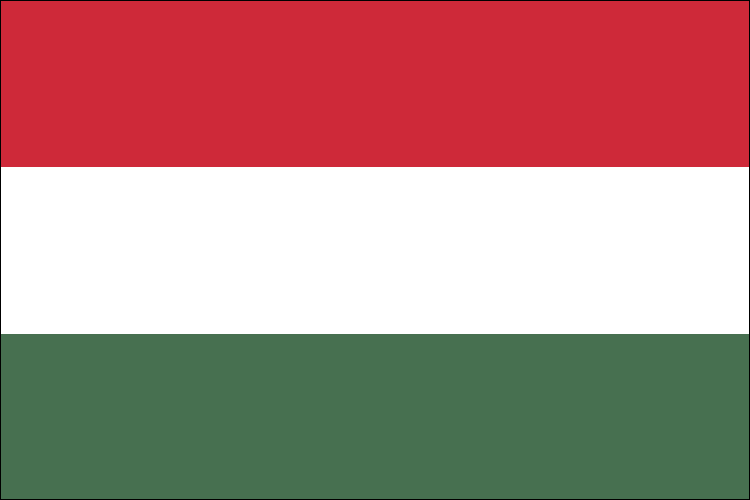

# National Flags

National flags created with shaders.

I saw a [video](https://www.youtube.com/watch?v=IGTuv_KKLFs) from [Tsoding](https://www.youtube.com/@TsodingDaily), and it gave me the idea to create my country's flag with a shader.

## Hungary's Flag

Here is an example:

The code that generates it is here:
[hungary/main.nim](hungary/main.nim).

## Contribution

If you want, you can send your national flag
in the form of a PR. Make a copy of the `hungary/` folder, rename it and customize
the code.

The program that generates `output.ppm`
can be written in any language but I'd
prefer to get Nim solutions. But it's not
a strict requirement.

The command `make all` must produce
the resulting PNG, thus don't forget
to edit the `Makefile`.
