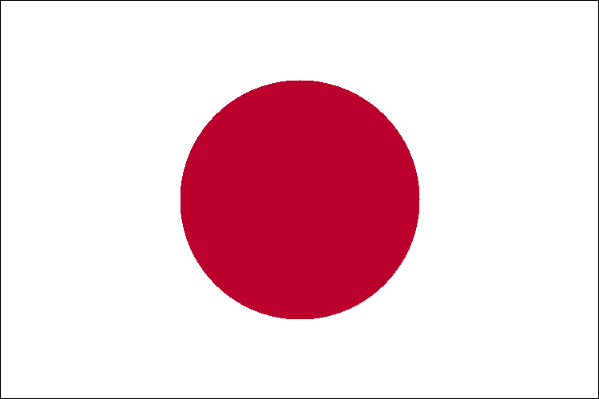

# Japan

<table border="1" bgcolor="lightgray">
<tr>
<td></td>
</tr>
</table>

## Links, etc.

* Exact RGB colors: https://www.flagcolorcodes.com/japan
* Proportion: **2:3**
* Circle's size: https://en.wikipedia.org/wiki/Flag_of_Japan#/media/File:Construction_sheet_of_the_Japanese_flag_EN.svg
